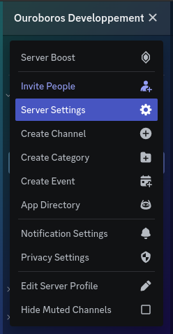
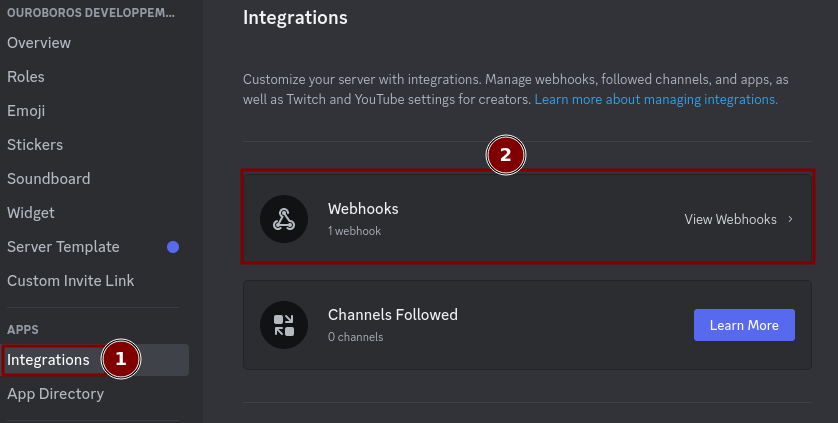
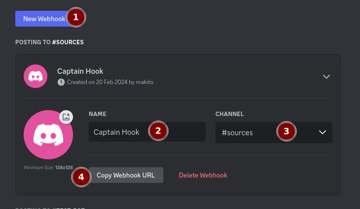

# How to use the webhook feature

## Step 1

Go to your discord server and click on the server settings then click on the integrations tab and create a webhook.

[](./images/goToServerSettings.png)

[](./images/goToWebhook.png)

[](./images/createWebhook.png)

## Step 2

Copy the webhook URL and paste it in the `WebhookURL` variable in the `config.sh` file in the section `Webhook` at the URL place don't forget to put the URL between double quotes like the example below.

```bash
########### Webhook ###########
WEBHOOK_ENABLED="NO"
URL="https://discord.com/api/webhooks/xxxxxxxxxxxxxxxxxxxx/xxxxxxxxxxxxxxxx"
```

don't forget to change the `WEBHOOK_ENABLED` variable to `YES` to enable the webhook feature.

>[!TIP]
>*I recommand you to mute the channel where the webhook will send the logs because it can be very spammy sometimes.*

>[!NOTE]
>The webhook feature will be reworked in the future to be more customizable and to be able to send only the logs you want.
